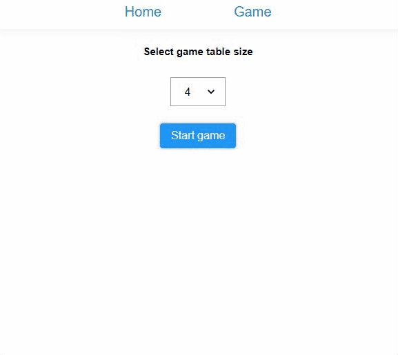

# Game of life

#### Rules
- Each cell with one or no neighbors dies, as if by solitude.
- Each cell with four or more neighbors dies, as if by overpopulation.
- Each cell with two or three neighbors survives.
- Each cell with three neighbors becomes populated.



### How to run it?

An entire application can be ran with a single command in a terminal:

```
$ docker-compose up -d
```

If you want to stop it use following command:

```
$ docker-compose down
```

#### URLs
- Frontend app: http://localhost:4200/
- Swagger: http://localhost:8080/swagger-ui.html

#### Database

PostgreSQL database contains only single schema with three tables:
- game_state
- row
- field


After running the docker compose it can be accessible using this connectors:

- Host: _localhost_
- Database: _game-of-life_
- User: _gol-postgres_
- Password: _gol-postgres_

#### Run only DB in docker container

```
docker run --name gol-postgres -e POSTGRES_PASSWORD=gol-postgres -d -p 5432:5432 postgres
```